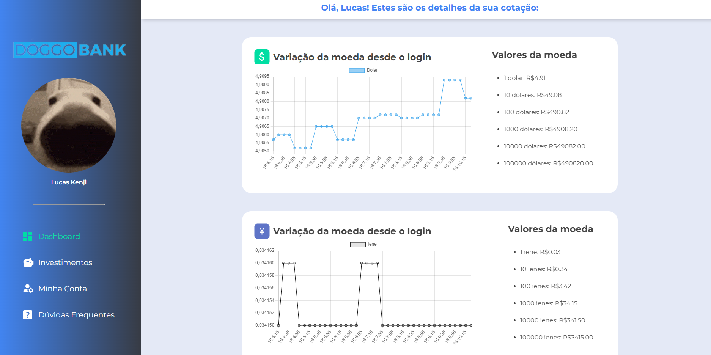

DoggoBank

Projeto "DoggoBank" desenvolvido durante o curso "JavaScript: trabalhando com threads para requisições simultâneas" da Alura.

## Screenshots

## Ferramentas utilizadas

- HTML
- CSS
- JavaScript
- API de Cotações (AwesomeAPI)

## Funcionalidades
- Atualização em tempo real da cotação das moedas dólar, iene e euro;
- Valores das moedas em valores específicos em reais (1, 10, 100, 1000 e 10000 reais). 

## Feito por:

Lucas Kenji (dinozindev).
